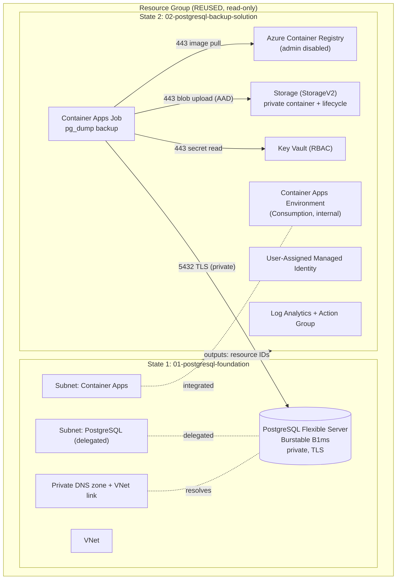
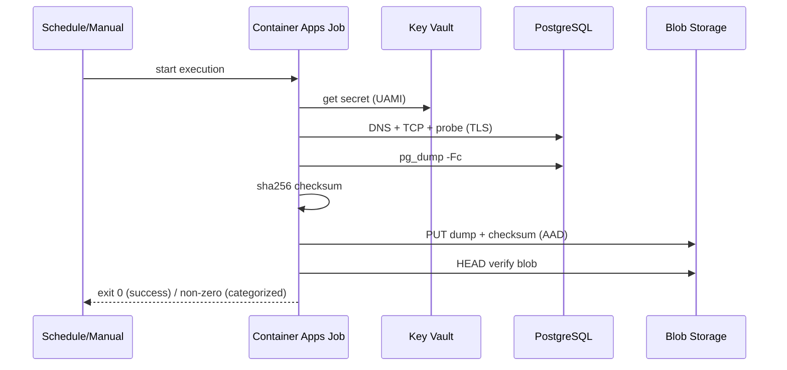

# Architecture Diagram

## System context

```mermaid
flowchart TB
  subgraph RG["Resource Group (REUSED, read-only)"]
    subgraph S1["State 1: 01-postgresql-foundation"]
      VNET["VNet"]
      SNPG["Subnet: PostgreSQL (delegated)"]
      SNCA["Subnet: Container Apps"]
      DNS["Private DNS zone + VNet link"]
      PG[("PostgreSQL Flexible Server\nBurstable B1ms\nprivate, TLS")]
    end
    subgraph S2["State 2: 02-postgresql-backup-solution"]
      UAMI["User-Assigned Managed Identity"]
      ACR["Azure Container Registry\n(admin disabled)"]
      KV["Key Vault (RBAC)"]
      ST["Storage (StorageV2)\nprivate container + lifecycle"]
      LAW["Log Analytics + Action Group"]
      CAE["Container Apps Environment\n(Consumption, internal)"]
      JOB["Container Apps Job\npg_dump backup"]
    end
  end

  S1 -- "outputs: resource IDs" --> S2
  JOB -- "5432 TLS (private)" --> PG
  JOB -- "443 secret read" --> KV
  JOB -- "443 blob upload (AAD)" --> ST
  JOB -- "443 image pull" --> ACR
  SNCA -. integrated .- CAE
  SNPG -. delegated .- PG
  DNS -. resolves .- PG
```

## Backup sequence

```mermaid
sequenceDiagram
  participant Sched as Schedule/Manual
  participant Job as Container Apps Job
  participant KV as Key Vault
  participant PG as PostgreSQL
  participant ST as Blob Storage
  Sched->>Job: start execution
  Job->>KV: get secret (UAMI)
  Job->>PG: DNS + TCP + probe (TLS)
  Job->>PG: pg_dump -Fc
  Job->>Job: sha256 checksum
  Job->>ST: PUT dump + checksum (AAD)
  Job->>ST: HEAD verify blob
  Job-->>Sched: exit 0 (success) / non-zero (categorized)
```
