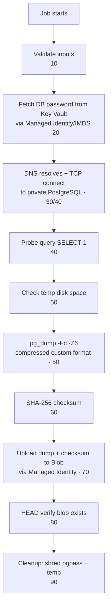

# PostgreSQL Backup — End-to-End Flow Explained

How the two Terraform stacks work together to back up your PostgreSQL database.

## The big idea: two separate Terraform states

The project is split into two independent Terraform configurations that are applied **in order**. Data flows one direction only — never backward (no circular dependency):

```
Resource Group (data) ──▶ State 1 (foundation) ──outputs──▶ State 2 (backup solution)
```

| | State 1 — `terraform/01-postgresql-foundation` | State 2 — `terraform/02-postgresql-backup-solution` |
|---|---|---|
| **Owns** | VNet, subnets, Private DNS, PostgreSQL server + database | Managed Identity, ACR, Storage, Key Vault, Log Analytics, Container Apps job, RBAC, alerts |
| **Changes** | Rarely (DBA/Network owned) | Often (Platform/Security owned) |
| **State file** | `...postgresql-foundation.tfstate` | `...postgresql-backup-solution.tfstate` |

**Why split?** Independent lifecycles, blast-radius isolation, and least-privilege — the backup team never gets write access to the database infrastructure state, and vice versa (see [two-state-design.md](two-state-design.md)).

---

## State 1 — Foundation (build the database + private network)

Three modules wired in `terraform/01-postgresql-foundation/main.tf`:

1. **`module.network`** — Creates (or reuses) the VNet and two delegated subnets: one for PostgreSQL, one for the Container Apps environment. A validation guardrail enforces "create *or* reuse, exactly one."
2. **`module.private_dns`** — Creates the `privatelink.postgres...` Private DNS zone and links it to the VNet, so the database FQDN resolves to a **private IP only** (no public exposure).
3. **`module.postgresql`** — Creates the Flexible Server injected into the private subnet, plus the database. `depends_on = [module.private_dns]` ensures DNS exists before the server so private resolution works immediately.

**Output:** the server FQDN, subnet IDs, DNS zone ID — these become **inputs** to State 2.

> Note: PostgreSQL Flexible Server *also* has its own built-in automated backups (`backup_retention_days`, geo-redundancy). State 2 adds an **independent, portable `pg_dump` backup to blob storage** on top of that — so you own a restorable copy outside the managed service.

---

## State 2 — Backup solution (the actual backup engine)

`terraform/02-postgresql-backup-solution/main.tf` builds the runtime. Order matters, and Terraform enforces it via dependencies:

1. **`managed_identity`** — A User-Assigned Managed Identity (UAMI). This is the *passwordless* identity the backup container uses for everything. **Always created first.**
2. **`container_registry`** (ACR) — Holds the backup container image.
3. **`storage`** (`modules/storage/main.tf`) — The blob account where dumps land. Hardened: shared keys disabled (Azure AD only), TLS 1.2, versioning, soft-delete, optional WORM immutability, and a **lifecycle policy** (auto-tier to cool/cold/archive, then delete).
4. **`key_vault`** — Stores the PostgreSQL admin password as a secret.
5. **`monitoring`** — Log Analytics + Action Group + alerts ("no successful backup in N hours", "job ran too long").
6. **`container_apps_environment`** — The serverless compute environment, injected into the private subnet so it can reach the DB privately.
7. **`role_assignments`** — Grants the UAMI: `AcrPull` (pull image), Key Vault secret read, and Storage Blob Data Contributor. **`container_apps_job` has `depends_on = [module.role_assignments]`** so the very first run already has permission to pull, read the secret, and write blobs.
8. **`container_apps_job`** — The scheduled backup job (cron via `enable_backup_schedule`). It runs the container, passing DB host, Key Vault URI, storage endpoint, and the UAMI client ID as env vars.

---

## How a backup actually runs

When the job fires, it runs `src/backup.sh`. Every step logs structured JSON and has a categorized exit code:



Key security properties of the backup itself:

- **No passwords anywhere in the command line or logs.** The password is fetched at runtime from Key Vault using the Managed Identity token (IMDS at `169.254.169.254`), written to a `0600` `PGPASSFILE`, and deleted on exit.
- **TLS enforced** to PostgreSQL (`PGSSLMODE`), and blob auth uses an Azure AD token — no storage keys.
- **Integrity:** a SHA-256 checksum is uploaded alongside the dump and stored as blob metadata.
- **Blob path** is deterministic and sanitized: `env/server/db/YYYY/MM/DD/db_timestamp_execid.dump` — safe against path traversal.

---

## Why it backs up the DB this way (the rationale)

- **`pg_dump` custom format (`-Fc`)** → compressed *and* restorable with `pg_restore` (see `src/restore-test.sh` / `scripts/restore-latest-backup.sh`) — a portable copy independent of Azure's managed backups.
- **Container Apps Job** → serverless, pay-per-run, no VM to patch; runs on a cron schedule.
- **Managed Identity + Key Vault** → zero long-lived secrets in the pipeline.
- **Private networking end-to-end** → the DB is never public; the job reaches it over the VNet.
- **Lifecycle + immutability on storage** → cost control (auto-tiering) and ransomware/tamper protection (WORM).

**Deployment order to reproduce it:** apply State 1 → capture its outputs → feed them into State 2's `terraform.tfvars` → apply State 2 → the scheduled job produces verified `.dump` files in blob storage.
